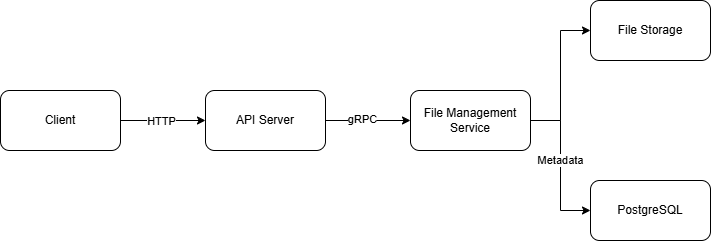

```markdown
# File Management Service

## 1. Objective

Develop a production-style **File Management Service** using **Go** that supports file upload and download while following a clean layered architecture.

The initial version focuses on synchronous REST APIs. Workflow orchestration using **Temporal** will be introduced in a future phase.

---

## 2. Scope

### Functional Requirements

- Upload a single file
- Upload multiple files
- Download a single file
- Download multiple files as a ZIP archive
- List uploaded files
- Retrieve file metadata

### Non-Functional Requirements

- Dockerized development environment
- PostgreSQL for metadata persistence
- Database migration support
- Configuration management
- Structured logging
- Unit testing
- Protobuf contract definitions
- Future Temporal integration

---

## 3. Architecture

### Phase 1



### Phase 2


---

## 4. Components

### API Server

**Responsibilities**

- Expose REST endpoints
- Validate requests
- Format API responses
- Trigger workflows (future)

---

### Service Layer

**Responsibilities**

- Implement business logic
- Validate uploaded files
- Coordinate storage and repository operations

---

### Storage Layer

**Responsibilities**

- Save files
- Read files
- Delete files

---

### Repository

**Responsibilities**

- Persist file metadata
- Query file metadata

---

### Database

Stores metadata including:

- File ID
- File name
- File path
- MIME type
- File size
- Upload timestamp

---

## 5. API Design

| Method | Endpoint               | Description                      |
| ------ | ---------------------- | -------------------------------- |
| POST   | `/files`               | Upload one or more files         |
| GET    | `/files`               | List uploaded files              |
| GET    | `/files/{id}/download` | Download a single file           |
| POST   | `/files/download`      | Download multiple files as ZIP   |
| GET    | `/files/{id}/metadata` | Retrieve file metadata           |
| GET    | `/health`              | Report that the service is alive |

---

## 6. Development Plan

| Milestone                             | Deliverables                                                                                                                    |
| ------------------------------------- | ------------------------------------------------------------------------------------------------------------------------------- |
| **Milestone 0 = Prepare API**         | Prepare API specification                                                                                                       |
| **Milestone 1 – Project Setup**       | Initialize project structure, Docker environment, PostgreSQL, database migrations, Protobuf definitions, and gRPC communication |
| **Milestone 2 – Core Implementation** | Implement file upload, download, deletion, metadata persistence, and local file storage                                         |
| **Milestone 3 – Finalization**        | Complete REST API, Swagger documentation, testing, logging, and project documentation                                           |

---

## 7. Deliverables

- REST API
- PostgreSQL schema
- Database migration scripts
- Docker Compose configuration
- Makefile
- Swagger documentation
- README
- Protobuf definitions
- Unit tests
- Temporal workflow implementation _(Phase 2)_
```
